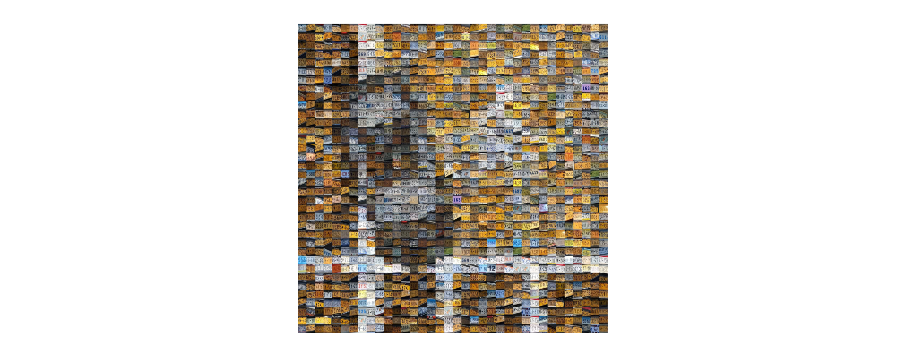

# 🚗 License Plate Labeling Guide

## 📂 Repository
Clone this repository to begin:  
[https://github.com/snooplsm/reported-ocr](https://github.com/snooplsm/reported-ocr)

```bash
# Clone the repository
git clone https://github.com/snooplsm/reported-ocr
cd reported-ocr
```

---

## 📋 Steps to Contribute

### 📝 Step 1: Identify and Rename Images
- Locate all images where the filename starts with `20xx-`.
- Rename each image to match the **license plate** visible in the image.
- Keep the `.jpg` extension intact.

### 🛠 Step 2: Handle Duplicate Files
- If a **duplicate license plate** exists, add an underscore (`_`) to the filename:
  - Example:
    - `ABC123.jpg` → `ABC123_.jpg`
    - `ABC123_.jpg` → `ABC123__.jpg`

### 🗑 Step 3: Delete Unreadable Images
- If the license plate in an image **cannot be read**, delete the image.

### 💾 Step 4: Stage and Commit Changes
```bash
git add .
git commit -m "Labeled license plate images"
```

### 🌱 Step 5: Push Changes to a New Branch
```bash
git checkout -b labeled-images
git push origin labeled-images
```

### 🔄 Step 6: Open a Merge Request
- Go to [https://github.com/snooplsm/reported-ocr](https://github.com/snooplsm/reported-ocr).
- Open a merge request for your changes.

---

## 🛠 Example Workflow

```bash
# Original Files
2024-ABC123.jpg
2024-XYZ789.jpg
2024-DEF456.jpg

# Renamed Files
ABC123.jpg
XYZ789.jpg
DEF456.jpg

# For Duplicates
ABC123.jpg
ABC123_.jpg

# For Unreadable Images
# Delete any image where the license plate cannot be determined.
```

---

## 🔍 Notes
- ✅ Please ensure filenames are **consistent and accurate** to avoid errors.
- 🔄 Double-check for duplicates before committing changes.

---

## 🙏 Thank You for Contributing!
Your efforts are greatly appreciated in improving this project! 🚀